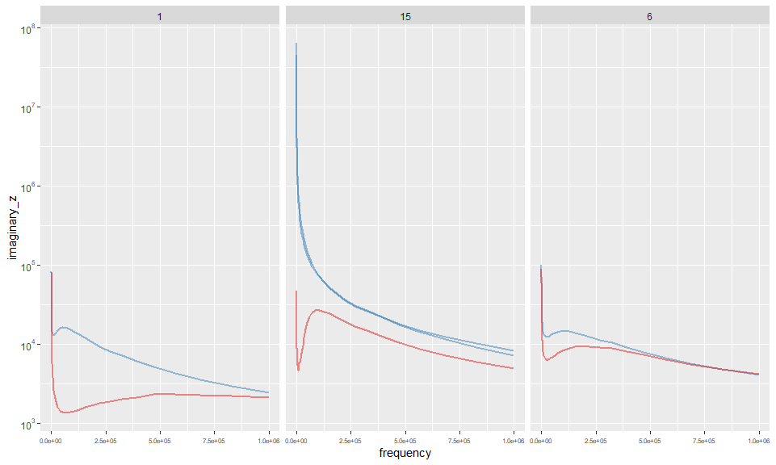
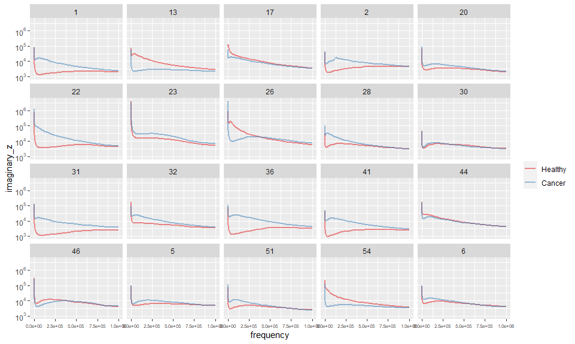

# Data

## Pre-processing

Patient 15 is the only patient with 2 sets of cancerous tissue measures, and
both of them are much much higher in terms of impedance values at the lowest
frequencies (demonstrated below, in comparison to two other randomly selected patients; note the log10 scale - these are very large differences). I have thus removed patient 15 for now (though the fact that both cancer samples appear unusual relative to the other patients may bear some consideration later). 

<!-- -->


## Description 

After the removal of this patient, the dataset now contains information on 20 patients, each with a set of measurements taken at 50 different frequencies on both cancerous and healthy tissue (20 patients X 50 frequencies X 2 tissue types = 2000 total measurements). 


### Key output values by patient and frequency

#### Imaginary Z

Values for each patient

<!-- -->

Superimposed values for each patient

<!-- -->

Cancer value minus healthy tissue value (note: y axis truncated at +/- 10^05)

<!-- -->

Distribution of values by frequency and tissue type

<!-- -->

<!-- -->


#### Real Z

Values for each patient 

<!-- -->

Superimposed values for each patient

<!-- -->

Cancer value minus healthy tissue value (note: y axis truncated at +/- 10^05)

<!-- -->

Distribution of values by frequency and tissue type

<!-- -->

<!-- -->


#### Magnitude z

Values for each patient

<!-- -->

Superimposed values for each patient 

<!-- -->

Cancer value minus healthy tissue value (note: y axis truncated at +/- 10^05)

<!-- -->

Distribution of values by frequency and tissue type

<!-- -->


# Prediction models

For now let's just so a simple logit and ignore the repeat samples. 


|          |       x|
|:---------|-------:|
|Dxy       |   0.466|
|C (ROC)   |   0.733|
|R2        |   0.250|
|D         |   0.207|
|D:Chi-sq  | 414.997|
|D:p       |      NA|
|U         |  -0.001|
|U:Chi-sq  |   0.000|
|U:p       |   1.000|
|Q         |   0.208|
|Brier     |   0.206|
|Intercept |   0.000|
|Slope     |   1.000|
|Emax      |   0.016|
|E90       |   0.011|
|Eavg      |   0.004|
|S:z       |   0.236|
|S:p       |   0.813|

<!-- -->


<!--html_preserve--><div class="container st-container">
<h3>Data Frame Summary</h3>
<h4>data</h4>
<strong>Dimensions</strong>: 2000 x 18
  <br/><strong>Duplicates</strong>: 0
<br/>
<table class="table table-striped table-bordered st-table st-table-striped st-table-bordered st-multiline ">
  <thead>
    <tr>
      <th align="center" class="st-protect-top-border"><strong>No</strong></th>
      <th align="center" class="st-protect-top-border"><strong>Variable</strong></th>
      <th align="center" class="st-protect-top-border"><strong>Stats / Values</strong></th>
      <th align="center" class="st-protect-top-border"><strong>Freqs (% of Valid)</strong></th>
      <th align="center" class="st-protect-top-border"><strong>Graph</strong></th>
      <th align="center" class="st-protect-top-border"><strong>Valid</strong></th>
      <th align="center" class="st-protect-top-border"><strong>Missing</strong></th>
    </tr>
  </thead>
  <tbody>
    <tr>
      <td align="center">1</td>
      <td align="left">id
[character]</td>
      <td align="left">1. 1
2. 13
3. 17
4. 2
5. 20
6. 22
7. 23
8. 26
9. 28
10. 30
[ 10 others ]</td>
      <td align="left" style="padding:0;vertical-align:middle"><table style="border-collapse:collapse;border:none;margin:0"><tr style="background-color:transparent"><td style="padding:0 5px 0 7px;margin:0;border:0" align="right">100</td><td style="padding:0 2px 0 0;border:0;" align="left">(</td><td style="padding:0;border:0" align="right">5.0%</td><td style="padding:0 4px 0 2px;border:0" align="left">)</td></tr><tr style="background-color:transparent"><td style="padding:0 5px 0 7px;margin:0;border:0" align="right">100</td><td style="padding:0 2px 0 0;border:0;" align="left">(</td><td style="padding:0;border:0" align="right">5.0%</td><td style="padding:0 4px 0 2px;border:0" align="left">)</td></tr><tr style="background-color:transparent"><td style="padding:0 5px 0 7px;margin:0;border:0" align="right">100</td><td style="padding:0 2px 0 0;border:0;" align="left">(</td><td style="padding:0;border:0" align="right">5.0%</td><td style="padding:0 4px 0 2px;border:0" align="left">)</td></tr><tr style="background-color:transparent"><td style="padding:0 5px 0 7px;margin:0;border:0" align="right">100</td><td style="padding:0 2px 0 0;border:0;" align="left">(</td><td style="padding:0;border:0" align="right">5.0%</td><td style="padding:0 4px 0 2px;border:0" align="left">)</td></tr><tr style="background-color:transparent"><td style="padding:0 5px 0 7px;margin:0;border:0" align="right">100</td><td style="padding:0 2px 0 0;border:0;" align="left">(</td><td style="padding:0;border:0" align="right">5.0%</td><td style="padding:0 4px 0 2px;border:0" align="left">)</td></tr><tr style="background-color:transparent"><td style="padding:0 5px 0 7px;margin:0;border:0" align="right">100</td><td style="padding:0 2px 0 0;border:0;" align="left">(</td><td style="padding:0;border:0" align="right">5.0%</td><td style="padding:0 4px 0 2px;border:0" align="left">)</td></tr><tr style="background-color:transparent"><td style="padding:0 5px 0 7px;margin:0;border:0" align="right">100</td><td style="padding:0 2px 0 0;border:0;" align="left">(</td><td style="padding:0;border:0" align="right">5.0%</td><td style="padding:0 4px 0 2px;border:0" align="left">)</td></tr><tr style="background-color:transparent"><td style="padding:0 5px 0 7px;margin:0;border:0" align="right">100</td><td style="padding:0 2px 0 0;border:0;" align="left">(</td><td style="padding:0;border:0" align="right">5.0%</td><td style="padding:0 4px 0 2px;border:0" align="left">)</td></tr><tr style="background-color:transparent"><td style="padding:0 5px 0 7px;margin:0;border:0" align="right">100</td><td style="padding:0 2px 0 0;border:0;" align="left">(</td><td style="padding:0;border:0" align="right">5.0%</td><td style="padding:0 4px 0 2px;border:0" align="left">)</td></tr><tr style="background-color:transparent"><td style="padding:0 5px 0 7px;margin:0;border:0" align="right">100</td><td style="padding:0 2px 0 0;border:0;" align="left">(</td><td style="padding:0;border:0" align="right">5.0%</td><td style="padding:0 4px 0 2px;border:0" align="left">)</td></tr><tr style="background-color:transparent"><td style="padding:0 5px 0 7px;margin:0;border:0" align="right">1000</td><td style="padding:0 2px 0 0;border:0;" align="left">(</td><td style="padding:0;border:0" align="right">50.0%</td><td style="padding:0 4px 0 2px;border:0" align="left">)</td></tr></table></td>
      <td align="left" style="vertical-align:middle;padding:0;background-color:transparent"></td>
      <td align="center">2000
(100%)</td>
      <td align="center">0
(0%)</td>
    </tr>
    <tr>
      <td align="center">2</td>
      <td align="left">frequency
[numeric]</td>
      <td align="left">Mean (sd) : 116705.8 (224123)
min < med < max:
100 < 10044 < 1e+06
IQR (CV) : 103855.9 (1.9)</td>
      <td align="left" style="vertical-align:middle">50 distinct values</td>
      <td align="left" style="vertical-align:middle;padding:0;background-color:transparent"></td>
      <td align="center">2000
(100%)</td>
      <td align="center">0
(0%)</td>
    </tr>
    <tr>
      <td align="center">3</td>
      <td align="left">magnitude_z_healthy
[numeric]</td>
      <td align="left">Mean (sd) : 83206.7 (265433)
min < med < max:
2458.3 < 21358.7 < 4748846
IQR (CV) : 48664 (3.2)</td>
      <td align="left" style="vertical-align:middle">1000 distinct values</td>
      <td align="left" style="vertical-align:middle;padding:0;background-color:transparent"></td>
      <td align="center">2000
(100%)</td>
      <td align="center">0
(0%)</td>
    </tr>
    <tr>
      <td align="center">4</td>
      <td align="left">magnitude_z_cancer
[numeric]</td>
      <td align="left">Mean (sd) : 100284.9 (361271.3)
min < med < max:
2428.7 < 35524.3 < 5978808
IQR (CV) : 51156.3 (3.6)</td>
      <td align="left" style="vertical-align:middle">1000 distinct values</td>
      <td align="left" style="vertical-align:middle;padding:0;background-color:transparent"></td>
      <td align="center">2000
(100%)</td>
      <td align="center">0
(0%)</td>
    </tr>
    <tr>
      <td align="center">5</td>
      <td align="left">real_z_healthy
[numeric]</td>
      <td align="left">Mean (sd) : 46286.6 (111219.8)
min < med < max:
-144124 < 16068.2 < 1998645
IQR (CV) : 28020.7 (2.4)</td>
      <td align="left" style="vertical-align:middle">1000 distinct values</td>
      <td align="left" style="vertical-align:middle;padding:0;background-color:transparent"></td>
      <td align="center">2000
(100%)</td>
      <td align="center">0
(0%)</td>
    </tr>
    <tr>
      <td align="center">6</td>
      <td align="left">real_z_cancer
[numeric]</td>
      <td align="left">Mean (sd) : 46529.7 (214729)
min < med < max:
-1399554 < 25923.1 < 5348633
IQR (CV) : 41359 (4.6)</td>
      <td align="left" style="vertical-align:middle">1000 distinct values</td>
      <td align="left" style="vertical-align:middle;padding:0;background-color:transparent"></td>
      <td align="center">2000
(100%)</td>
      <td align="center">0
(0%)</td>
    </tr>
    <tr>
      <td align="center">7</td>
      <td align="left">imaginary_z_healthy
[numeric]</td>
      <td align="left">Mean (sd) : 58446.8 (241443.3)
min < med < max:
952.6 < 10628.6 < 4217932
IQR (CV) : 32425.8 (4.1)</td>
      <td align="left" style="vertical-align:middle">1000 distinct values</td>
      <td align="left" style="vertical-align:middle;padding:0;background-color:transparent"></td>
      <td align="center">2000
(100%)</td>
      <td align="center">0
(0%)</td>
    </tr>
    <tr>
      <td align="center">8</td>
      <td align="left">imaginary_z_cancer
[numeric]</td>
      <td align="left">Mean (sd) : 70202.7 (285018)
min < med < max:
2171.3 < 15846.1 < 4303403
IQR (CV) : 24432.9 (4.1)</td>
      <td align="left" style="vertical-align:middle">1000 distinct values</td>
      <td align="left" style="vertical-align:middle;padding:0;background-color:transparent"></td>
      <td align="center">2000
(100%)</td>
      <td align="center">0
(0%)</td>
    </tr>
    <tr>
      <td align="center">9</td>
      <td align="left">patient_id
[character]</td>
      <td align="left">1. Patient 1 Cancer
2. Patient 1 Healthy
3. Patient 13 Cancer
4. Patient 13 Healthy
5. Patient 17 Cancer
6. Patient 17 Healthy
7. Patient 2 Cancer
8. Patient 2 Healthy
9. Patient 20 Cancer
10. Patient 20 Healthy
[ 30 others ]</td>
      <td align="left" style="padding:0;vertical-align:middle"><table style="border-collapse:collapse;border:none;margin:0"><tr style="background-color:transparent"><td style="padding:0 5px 0 7px;margin:0;border:0" align="right">50</td><td style="padding:0 2px 0 0;border:0;" align="left">(</td><td style="padding:0;border:0" align="right">2.5%</td><td style="padding:0 4px 0 2px;border:0" align="left">)</td></tr><tr style="background-color:transparent"><td style="padding:0 5px 0 7px;margin:0;border:0" align="right">50</td><td style="padding:0 2px 0 0;border:0;" align="left">(</td><td style="padding:0;border:0" align="right">2.5%</td><td style="padding:0 4px 0 2px;border:0" align="left">)</td></tr><tr style="background-color:transparent"><td style="padding:0 5px 0 7px;margin:0;border:0" align="right">50</td><td style="padding:0 2px 0 0;border:0;" align="left">(</td><td style="padding:0;border:0" align="right">2.5%</td><td style="padding:0 4px 0 2px;border:0" align="left">)</td></tr><tr style="background-color:transparent"><td style="padding:0 5px 0 7px;margin:0;border:0" align="right">50</td><td style="padding:0 2px 0 0;border:0;" align="left">(</td><td style="padding:0;border:0" align="right">2.5%</td><td style="padding:0 4px 0 2px;border:0" align="left">)</td></tr><tr style="background-color:transparent"><td style="padding:0 5px 0 7px;margin:0;border:0" align="right">50</td><td style="padding:0 2px 0 0;border:0;" align="left">(</td><td style="padding:0;border:0" align="right">2.5%</td><td style="padding:0 4px 0 2px;border:0" align="left">)</td></tr><tr style="background-color:transparent"><td style="padding:0 5px 0 7px;margin:0;border:0" align="right">50</td><td style="padding:0 2px 0 0;border:0;" align="left">(</td><td style="padding:0;border:0" align="right">2.5%</td><td style="padding:0 4px 0 2px;border:0" align="left">)</td></tr><tr style="background-color:transparent"><td style="padding:0 5px 0 7px;margin:0;border:0" align="right">50</td><td style="padding:0 2px 0 0;border:0;" align="left">(</td><td style="padding:0;border:0" align="right">2.5%</td><td style="padding:0 4px 0 2px;border:0" align="left">)</td></tr><tr style="background-color:transparent"><td style="padding:0 5px 0 7px;margin:0;border:0" align="right">50</td><td style="padding:0 2px 0 0;border:0;" align="left">(</td><td style="padding:0;border:0" align="right">2.5%</td><td style="padding:0 4px 0 2px;border:0" align="left">)</td></tr><tr style="background-color:transparent"><td style="padding:0 5px 0 7px;margin:0;border:0" align="right">50</td><td style="padding:0 2px 0 0;border:0;" align="left">(</td><td style="padding:0;border:0" align="right">2.5%</td><td style="padding:0 4px 0 2px;border:0" align="left">)</td></tr><tr style="background-color:transparent"><td style="padding:0 5px 0 7px;margin:0;border:0" align="right">50</td><td style="padding:0 2px 0 0;border:0;" align="left">(</td><td style="padding:0;border:0" align="right">2.5%</td><td style="padding:0 4px 0 2px;border:0" align="left">)</td></tr><tr style="background-color:transparent"><td style="padding:0 5px 0 7px;margin:0;border:0" align="right">1500</td><td style="padding:0 2px 0 0;border:0;" align="left">(</td><td style="padding:0;border:0" align="right">75.0%</td><td style="padding:0 4px 0 2px;border:0" align="left">)</td></tr></table></td>
      <td align="left" style="vertical-align:middle;padding:0;background-color:transparent"></td>
      <td align="center">2000
(100%)</td>
      <td align="center">0
(0%)</td>
    </tr>
    <tr>
      <td align="center">10</td>
      <td align="left">real_z
[numeric]</td>
      <td align="left">Mean (sd) : 46408.1 (170994.8)
min < med < max:
-1399554 < 20072.8 < 5348633
IQR (CV) : 35032.3 (3.7)</td>
      <td align="left" style="vertical-align:middle">2000 distinct values</td>
      <td align="left" style="vertical-align:middle;padding:0;background-color:transparent"></td>
      <td align="center">2000
(100%)</td>
      <td align="center">0
(0%)</td>
    </tr>
    <tr>
      <td align="center">11</td>
      <td align="left">imaginary_z
[numeric]</td>
      <td align="left">Mean (sd) : 64324.7 (264196.2)
min < med < max:
952.6 < 14170.5 < 4303403
IQR (CV) : 28035.2 (4.1)</td>
      <td align="left" style="vertical-align:middle">2000 distinct values</td>
      <td align="left" style="vertical-align:middle;padding:0;background-color:transparent"></td>
      <td align="center">2000
(100%)</td>
      <td align="center">0
(0%)</td>
    </tr>
    <tr>
      <td align="center">12</td>
      <td align="left">magnitude_z
[numeric]</td>
      <td align="left">Mean (sd) : 91745.8 (317110)
min < med < max:
2428.7 < 28339.1 < 5978808
IQR (CV) : 52024 (3.5)</td>
      <td align="left" style="vertical-align:middle">2000 distinct values</td>
      <td align="left" style="vertical-align:middle;padding:0;background-color:transparent"></td>
      <td align="center">2000
(100%)</td>
      <td align="center">0
(0%)</td>
    </tr>
    <tr>
      <td align="center">13</td>
      <td align="left">phase_angle
[numeric]</td>
      <td align="left">Mean (sd) : 38.6 (21.6)
min < med < max:
8.3 < 32.5 < 127.3
IQR (CV) : 32.4 (0.6)</td>
      <td align="left" style="vertical-align:middle">2000 distinct values</td>
      <td align="left" style="vertical-align:middle;padding:0;background-color:transparent"></td>
      <td align="center">2000
(100%)</td>
      <td align="center">0
(0%)</td>
    </tr>
    <tr>
      <td align="center">14</td>
      <td align="left">type
[factor]</td>
      <td align="left">1. Healthy
2. Cancer</td>
      <td align="left" style="padding:0;vertical-align:middle"><table style="border-collapse:collapse;border:none;margin:0"><tr style="background-color:transparent"><td style="padding:0 5px 0 7px;margin:0;border:0" align="right">1000</td><td style="padding:0 2px 0 0;border:0;" align="left">(</td><td style="padding:0;border:0" align="right">50.0%</td><td style="padding:0 4px 0 2px;border:0" align="left">)</td></tr><tr style="background-color:transparent"><td style="padding:0 5px 0 7px;margin:0;border:0" align="right">1000</td><td style="padding:0 2px 0 0;border:0;" align="left">(</td><td style="padding:0;border:0" align="right">50.0%</td><td style="padding:0 4px 0 2px;border:0" align="left">)</td></tr></table></td>
      <td align="left" style="vertical-align:middle;padding:0;background-color:transparent"></td>
      <td align="center">2000
(100%)</td>
      <td align="center">0
(0%)</td>
    </tr>
    <tr>
      <td align="center">15</td>
      <td align="left">imaginary_z_diff
[numeric]</td>
      <td align="left">Mean (sd) : 11755.9 (175475.1)
min < med < max:
-2982726 < 3080.8 < 3376070.2
IQR (CV) : 15318.2 (14.9)</td>
      <td align="left" style="vertical-align:middle">1000 distinct values</td>
      <td align="left" style="vertical-align:middle;padding:0;background-color:transparent"></td>
      <td align="center">2000
(100%)</td>
      <td align="center">0
(0%)</td>
    </tr>
    <tr>
      <td align="center">16</td>
      <td align="left">real_z_diff
[numeric]</td>
      <td align="left">Mean (sd) : 243.2 (207663)
min < med < max:
-2045921.4 < 4216.5 < 3349988
IQR (CV) : 26245.9 (854)</td>
      <td align="left" style="vertical-align:middle">999 distinct values</td>
      <td align="left" style="vertical-align:middle;padding:0;background-color:transparent"></td>
      <td align="center">2000
(100%)</td>
      <td align="center">0
(0%)</td>
    </tr>
    <tr>
      <td align="center">17</td>
      <td align="left">magnitude_z_diff
[numeric]</td>
      <td align="left">Mean (sd) : 17078.2 (168428.8)
min < med < max:
-346411.4 < 6106.8 < 3235022
IQR (CV) : 33233.3 (9.9)</td>
      <td align="left" style="vertical-align:middle">1000 distinct values</td>
      <td align="left" style="vertical-align:middle;padding:0;background-color:transparent"></td>
      <td align="center">2000
(100%)</td>
      <td align="center">0
(0%)</td>
    </tr>
    <tr>
      <td align="center">18</td>
      <td align="left">m1_pred
[numeric]</td>
      <td align="left">Mean (sd) : 0.5 (0.2)
min < med < max:
0 < 0.5 < 1
IQR (CV) : 0.2 (0.4)</td>
      <td align="left" style="vertical-align:middle">1991 distinct values</td>
      <td align="left" style="vertical-align:middle;padding:0;background-color:transparent"></td>
      <td align="center">2000
(100%)</td>
      <td align="center">0
(0%)</td>
    </tr>
  </tbody>
</table>
<p>Generated by <a href='https://github.com/dcomtois/summarytools'>summarytools</a> 0.9.6 (<a href='https://www.r-project.org/'>R</a> version 4.0.3)<br/>2021-01-18</p>
</div><!--/html_preserve-->


```
## 
## System: Windows 10 x64 build 18363
## Nodename: DESKTOP-JKQ7LTN, User: Darren
## Total Memory: 16168 MB
## 
## R version 4.0.3 (2020-10-10) 
## x86_64-w64-mingw32/x64 (64-bit) 
## 
## Loaded Packages: 
##  RColorBrewer (1.1-2), scales (1.1.1), knitr (1.30), rms (6.0-1), SparseM (1.78), Hmisc (4.4-1), Formula (1.2-3), survival (3.2-7), lattice (0.20-41), patchwork (1.0.1), flextable (0.5.11), viridis (0.5.1), viridisLite (0.3.0), forcats (0.5.0), stringr (1.4.0), dplyr (1.0.2), purrr (0.3.4), readr (1.4.0), tidyr (1.1.2), tibble (3.0.4), ggplot2 (3.3.2), tidyverse (1.3.0), descr (1.1.4)
```
